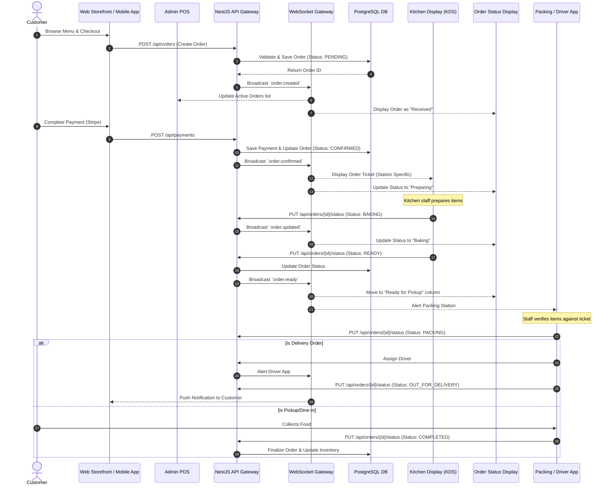

# System Data Flow

This document outlines the high-level data flow within the Restaurant Management System, focusing primarily on the **Order Lifecycle**, which represents the most complex and critical data path in the application.

## Order Lifecycle Flow

The following diagram illustrates how an order moves through the various applications and backend services, from initial placement to final delivery.

## Key Data Flow Concepts

### 1. HTTP vs. WebSockets
* **HTTP/REST:** Used for all state-mutating actions (CRUD operations, creating orders, processing payments). The `NestJS API` handles validation, authorization, and database persistence.
* **WebSockets:** Used purely for **read-only reactive updates**. When an entity in the database changes via the REST API, the API triggers an event through the `WebSocket Gateway`, pushing the new state to all connected clients (POS, KDS, OSDU) instantly.

### 2. State Management & Inventory
* As the order status progresses (e.g., to `COMPLETED`), background workers (via Bull Queue) may trigger inventory depletion.
* The system looks at the `OrderItems`, maps them to a `Recipe`, and calculates the required `InventoryItems` to deduct from `currentStock`.

### 3. Kitchen Routing
* Not all items go to all screens. When an order is broadcasted to the KDS, the frontend (or backend logic) filters `OrderItems` based on their `KitchenStation` enum. 
* Pizzas go to the Pizza screen, Fries to the Fryer screen. Only the Packing/Dispatch screen sees the aggregated, complete order.
