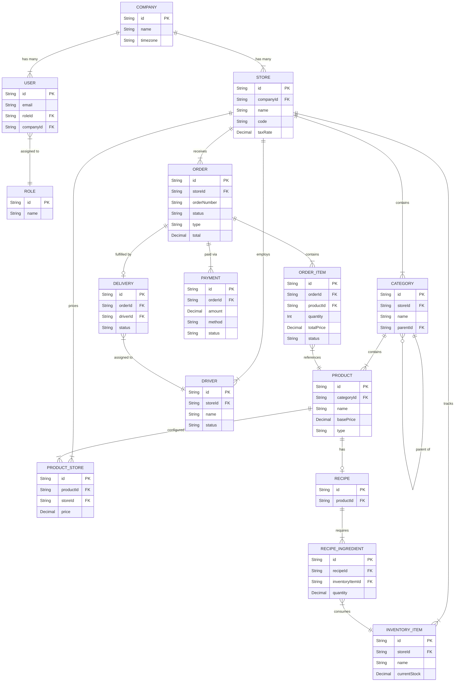

# Entity-Relationship Diagram (ERD)

Below is a high-level Entity-Relationship Diagram outlining the core data models and their relationships within the Restaurant Management System. This diagram focuses on the most critical entities (Stores, Users, Products, Orders, and Inventory) to provide a clear architectural overview.

### Key Subsystems:

1. **Multi-Tenant Structure:** A `Company` can own multiple `Stores`. Users are scoped either to a company or specific stores via their `Role`.
2. **Menu Management:** `Categories` organize `Products`. Because prices can vary by location, `ProductStore` maps specific overrides (like price or availability) for a given `Store`.
3. **Order Flow:** An `Order` belongs to a `Store` and contains multiple `OrderItems`. It tracks financial completion via `Payments` and logistics via `Delivery` (assigned to a `Driver`).
4. **Inventory & Recipes:** A `Product` can have a `Recipe` made up of `RecipeIngredients`. These ingredients map directly to physical `InventoryItems` tracked at the `Store` level, enabling automated stock depletion.
